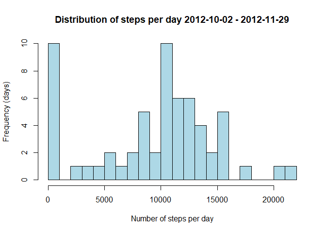

- Loading and preprocessing the data
- What is mean total number of steps taken per day?
- What is the average daily activity pattern?
- Imputing missing values
- Are there differences in activity patterns between weekdays and weekends?

### Loading and preprocessing the data
Source data is in activity.zip file

##### The variables:
  
- steps: Number of steps made in a 5-minute interval (missing values are coded as NA)
- date: The date on which the measurement was taken in YYYY-MM-DD format
- interval: Identifier in minutes in which measurement was taken

##### Unzip & load the data


```r
unzip('activity.zip')
data <- read.csv('activity.csv', header = TRUE)
```

### What is mean total number of steps taken per day?  

##### 1. Calculate the total number of steps taken per day  


```r
data_per_day <- aggregate(steps ~ date, data=data, FUN = 'sum')
```


##### 2. Make a histogram of the total number of steps taken each day  


```r
hist(data_per_day$steps, xlab = 'Number of steps per day', ylab = 'Frequency (days)', 
     main = 'Distribution of steps per day 2012-10-02 - 2012-11-29', col='lightgreen', breaks=20)
```

<!-- -->


##### 3. Calculate and report the mean and median of the total number of steps taken per day  


```r
data_per_day_mean <- mean(data_per_day$steps)
data_per_day_median <- median(data_per_day$steps)
```

The mean is **1.076619\times 10^{4}.**  
The median is **10765.** 


### What is the average daily activity pattern?
##### 1. A time series plot of the 5-minute interval (x-axis) and the average number of steps taken, averaged across all days (y-axis)


```r
data_per_interval <- aggregate(steps ~ interval, data=data, FUN = 'mean')

plot(data_per_interval$interval, data_per_interval$steps, type="l", xlab = "5 min - interval", 
     ylab = "Average steps", main = "Average Daily Activity Pattern", col = "green")
```

<!-- -->

##### 2. Which 5-minute interval, on average across all the days in the dataset, contains the maximum number of steps?


```r
data_per_interval$interval[which.max(data_per_interval$steps)]
```

```
## [1] 835
```

### Imputing missing values

##### 1. Total number of missing values in the dataset 

```r
sum(is.na(data))
```

```
## [1] 2304
```

##### 2. Strategy for filling in all of the missing values in the dataset. 

If more than 10 NAs than the device was either off or not in use so then mean of a similar day.  
If only single NA is missing then mean compute the mean of previous and next interval.


##### 3. Create a new dataset that is equal to the original dataset but with the missing data filled in.


```r
data_no_NAs <- data
data_no_NAs[is.na(data$steps), "steps"] <- 0
```

##### 4.1. Histogram of the total number of steps taken each day  

```r
data_per_day_no_NAs <- aggregate(steps ~ date, data=data_no_NAs, FUN = 'sum')

hist(data_per_day_no_NAs$steps, xlab = 'Number of steps per day', ylab = 'Frequency (days)', 
     main = 'Distribution of steps per day 2012-10-02 - 2012-11-29', col='lightblue', breaks=20)
```

<!-- -->


##### 4.2. Calculate and report the mean and median total number of steps taken per day.  

```r
data_per_day_mean_no_NAs <- mean(data_per_day_no_NAs$steps)
data_per_day_median_no_NAs <- median(data_per_day_no_NAs$steps)
```

The mean is **9354.23.**  
The median is **1.0395\times 10^{4}.**  
The difference between the mean and median in this dataset is **1040.7704918.**.  
The difference between the mean and median in dataset where NAs are removed is **-1.1886792.**  
NA filling function with 0 changed the mean more than median.

### Are there differences in activity patterns between weekdays and weekends?

##### 1. Create a new factor variable in the dataset with two levels – “weekday” and “weekend” indicating whether a given date is a weekday or weekend day. (Sunday=0, Monday=1...)


```r
data_no_NAs$day <- as.POSIXlt(data_no_NAs$date)$wday
data_no_NAs$dayType <- as.factor(ifelse(data_no_NAs$day == 0 | data_no_NAs$day == 6, "weekend", "weekday"))

head(data_no_NAs)
```

```
##   steps       date interval day dayType
## 1     0 2012-10-01        0   1 weekday
## 2     0 2012-10-01        5   1 weekday
## 3     0 2012-10-01       10   1 weekday
## 4     0 2012-10-01       15   1 weekday
## 5     0 2012-10-01       20   1 weekday
## 6     0 2012-10-01       25   1 weekday
```

##### 2. Make a panel plot containing a time series plot (type="l") of the 5-minute interval (x-axis) and the average number of steps taken, averaged across all weekday days or weekend days (y-axis). 


```r
weekday_Data <- data_no_NAs[data_no_NAs$dayType == "weekday",]
weekend_Data <- data_no_NAs[data_no_NAs$dayType == "weekend",]
data_per_weekday <- aggregate(steps ~ interval, weekday_Data, mean)
data_per_weekend <- aggregate(steps ~ interval, weekend_Data, mean)

par(mfrow = c(2, 1))

plot(data_per_weekday, type = "l", col = "green", main = "Weekdays")
plot(data_per_weekend, type = "l", col = "red", main = "Weekends")
```

<!-- -->
